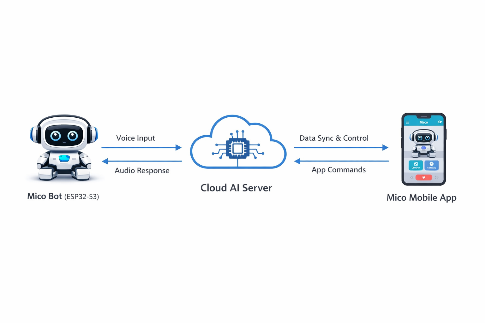
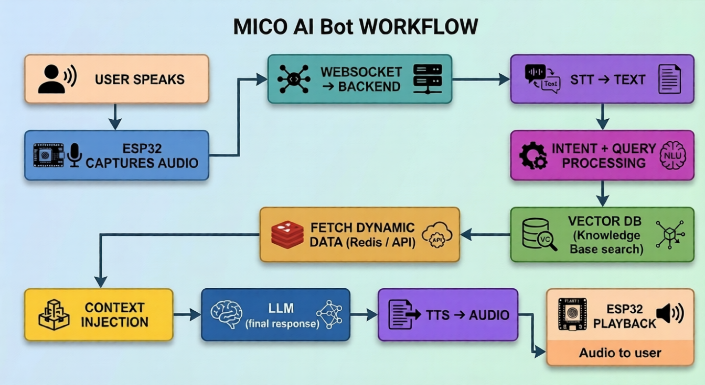

# 🤖 MICO AI - Voice AI Ecosystem

## 📌 Overview

MICO AI is a complete **Voice AI Ecosystem** built using an ESP32-based conversational bot, a mobile application, and a cloud-based AI backend. The system enables real-time voice interaction between users and an intelligent AI agent.

The architecture is designed for **low-latency, real-time communication**, combining hardware, cloud AI services, and mobile control.

---

## 🧩 System Architecture

The MICO AI system consists of three main components:

### 1. 🧠 Cloud AI Server (AWS)

The backend is hosted on AWS and handles all AI processing.

**Core Components:**
- WebSocket Server (Real-time communication)
- Speech-to-Text (STT)
- Large Language Model (LLM)
- Text-to-Speech (TTS)
- Knowledge Base (Vector Database)
- Redis (Dynamic Data / Caching)
- PostgreSQL (Static Data Storage)

**AI Services Used:**
- OpenAI APIs for:
  - STT
  - LLM
  - TTS

---

### 2. 🤖 MICO AI Bot (ESP32-S3)

A hardware-based conversational device.

**Hardware Components:**
- ESP32-S3 Microcontroller
- Microphone (Audio Input)
- Speaker (Audio Output)
- Battery (Portable Power)

**Functionality:**
- Captures user voice
- Sends audio to cloud via WebSocket
- Receives AI-generated audio response
- Plays response through speaker

---

### 3. 📱 MICO Mobile App

Acts as the control and monitoring interface.

**Features:**
- Initial device pairing
- WiFi configuration (user enters credentials)
- Sends WiFi credentials to ESP32
- View conversation logs
- Manage bot settings

---

## 🔗 System Interaction Flow

<p align="center" width="100%">
    
</p>

The system follows a **triangular communication model**:

- Bot ↔ Cloud (Voice communication)
- App ↔ Cloud (Control & data sync)
- App → Bot (Initial setup via WiFi provisioning)

---

## 🔄 End-to-End Workflow

<p align="center" width="100%">
    
</p>

```
User speaks
   ↓
ESP32 captures audio
   ↓
WebSocket → Backend
   ↓
STT → Text
   ↓
Intent + Query processing
   ↓
Vector DB (Knowledge Base search)
   ↓
Fetch dynamic data (Redis / API)
   ↓
Context injection
   ↓
LLM (final response)
   ↓
TTS → Audio
   ↓
WebSocket → ESP32
   ↓
ESP32 playback
```

---

## 🧠 AI Processing Pipeline Explained

### 1. 🎤 Audio Capture
- User speaks into the MICO Bot
- ESP32 records audio input

### 2. 🌐 Real-Time Transmission
- Audio is streamed to backend via WebSocket
- Enables low-latency communication

### 3. 📝 Speech-to-Text (STT)
- Converts audio into text
- Powered by OpenAI STT

### 4. 🧩 Intent & Query Processing
- Understands user intent
- Prepares structured query for AI system

### 5. 📚 Knowledge Base Retrieval
- Searches vector database for relevant information
- Adds contextual grounding

### 6. ⚡ Dynamic Data Fetching
- Retrieves real-time data from:
  - Redis (cached data)
  - External APIs

### 7. 🧠 Context Injection
- Combines:
  - User query
  - Knowledge base results
  - Dynamic data

### 8. 🤖 LLM Response Generation
- Generates intelligent response
- Uses OpenAI LLM

### 9. 🔊 Text-to-Speech (TTS)
- Converts response text into audio

### 10. 📡 Response Delivery
- Audio sent back to ESP32 via WebSocket

### 11. 🔈 Playback
- ESP32 plays response through speaker

---

## 🗄️ Data Architecture

### 🔴 Redis (Dynamic Data)
- Real-time data
- Session storage
- Fast retrieval

### 🟦 PostgreSQL (Static Data)
- User data
- Device mapping
- Configuration settings

### 🟢 Vector Database (Knowledge Base)
- Semantic search
- Context-aware responses

---

## ⚙️ Key Design Considerations

### ⚡ Low Latency
- WebSocket for real-time streaming
- Redis for fast access

### 🔄 Scalability
- Cloud-native (AWS)
- Modular services

### 🔐 Reliability
- Persistent storage (PostgreSQL)
- Fault-tolerant architecture

### 🧠 Intelligence
- Context-aware AI responses
- Knowledge + real-time data fusion

---

## 🚀 Future Enhancements (Suggested)

- Interrupt handling (barge-in support)
- Multi-language support
- Personalization per user
- Offline fallback (edge inference)
- Streaming TTS for faster responses

---

# 🚀 FINAL PRODUCTION DEPLOYMENT (1000+ DEVICES)

## 🛠️ Deployment Stack

- Docker (Containerization)
- Kubernetes (Orchestration)
- AWS EKS / EC2 (Infrastructure)
- AWS Load Balancer (Traffic distribution)
- Redis (Sessions)
- PostgreSQL RDS (Persistent DB)
- Vector DB (Knowledge)
- CI/CD (GitHub Actions / GitLab)

---

## ☁️ Complete Deployment Workflow

Developer pushes code  
→ GitHub / GitLab  
→ CI/CD Pipeline  
→ Docker Build  
→ Push to Docker Hub / AWS ECR  
→ Kubernetes pulls image  
→ Pods deployed  
→ Load Balancer exposes service  
→ ESP32 devices connect  

---

## 🧱 Production Architecture

ESP32 Devices / Mobile App  
→ AWS Load Balancer  
→ Kubernetes Cluster (EKS)  
→ Backend Pods:
   - WebSocket Server
   - AI Processing
   - API Server  
→ Redis + PostgreSQL + Vector DB  
→ OpenAI APIs  

---

## 📈 Scaling Strategy (1000 Devices)

- 3–5 WebSocket pods
- 3–5 AI processing pods
- Horizontal Pod Autoscaler enabled
- Managed Redis (Elasticache recommended)
- PostgreSQL via AWS RDS

---

## 🔄 Kubernetes Deployment Flow

Docker Image → Kubernetes Deployment → Pods → Service → Load Balancer → Devices

---

## 📌 Summary

MICO AI is a **production-grade Voice AI system** combining:

- Embedded hardware (ESP32)
- Cloud AI processing (AWS + OpenAI)
- Mobile control interface

It delivers a seamless **real-time conversational experience** using a well-structured pipeline of STT → Intelligence → TTS.

---

## 📷 Image Placement Guide

- Place **System Architecture Image** under *System Interaction Flow*
- Place **Workflow Diagram** under *End-to-End Workflow*

---

✅ This document is structured for:
- Project documentation
- GitHub README
- Technical presentation

